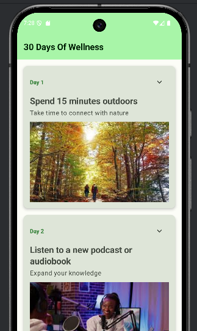
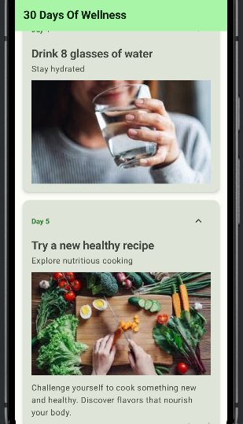

# 30 Days Of Wellness 🍃

## 📸 Capturas de Pantalla

**Vista General**  
*Interfaz principal mostrando la lista de 30 días de actividades de wellness*

 

**Detalle Expandido**  
*Tarjeta expandida mostrando la descripción completa de la actividad del día*

## 📱 Características

- **Interfaz moderna**: Desarrollada completamente con Jetpack Compose
- **Diseño Material 3**: Sigue las últimas guías de diseño de Material Design
- **Lista interactiva**: Scroll suave con tarjetas expandibles
- **Animaciones**: Transiciones fluidas al expandir/contraer contenido
- **Tema adaptable**: Soporte completo para modo claro y oscuro
- **Contenido local**: No requiere conexión a internet

## 🎯 Funcionalidades

- 30 actividades diarias de wellness
- Tarjetas expandibles con descripciones completas
- Imágenes inspiradoras para cada día
- Interfaz intuitiva y fácil de usar
- Diseño responsive para diferentes tamaños de pantalla

## 🛠️ Tecnologías Utilizadas

- **Kotlin** - Lenguaje de programación
- **Jetpack Compose** - Toolkit moderno de UI
- **Material Design 3** - Sistema de diseño
- **Android Studio** - IDE de desarrollo
- **Coil** - Carga de imágenes

## 🚀 Cómo Ejecutar

1. Clona el repositorio
2. Abre el proyecto en Android Studio
3. Sincroniza las dependencias de Gradle
4. Ejecuta en un emulador o dispositivo físico

## 📋 Requisitos

- Android Studio Hedgehog o superior
- SDK de Android 33+
- Dispositivo con Android 8.0+ (API 26+)

## 🏗️ Estructura del Proyecto
